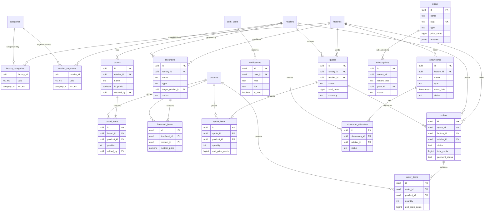

# Data Architecture: MOBIO — Sprint 3

> Atelier Fábrica — Catálogo: pendências S1 + boards + linesheets + quotes + orders + showrooms + plans + storage buckets

## Diagrama de Entidades — Tabelas Novas (Mermaid)



## Migrations — Sprint 3

16 arquivos em `supabase/migrations/` (timestamps 20260507140000–20260507140015):

| #   | Arquivo                                          | Grupo | Conteúdo                                                                |
| --- | ------------------------------------------------ | ----- | ----------------------------------------------------------------------- |
| A1  | `20260507140000_factories_cnpj.sql`              | A     | ALTER TABLE factories ADD cnpj CITEXT UNIQUE + índice                   |
| A2  | `20260507140001_factory_categories.sql`          | A     | Junction factory_categories + RLS + índices                             |
| A3  | `20260507140002_retailer_segments.sql`           | A     | Junction retailer_segments + RLS + índices                              |
| A4  | `20260507140003_boards.sql`                      | A     | boards + RLS member/public + trigger updated_at + índices               |
| A5  | `20260507140004_board_items.sql`                 | A     | board_items + RLS herdada de boards + índices                           |
| A6  | `20260507140005_linesheets.sql`                  | A     | linesheets + RLS factory/retailer + trigger updated_at                  |
| A7  | `20260507140006_linesheet_items.sql`             | A     | linesheet_items + RLS herdada + índices                                 |
| A8  | `20260507140007_notifications.sql`               | A     | notifications + RLS self-only + índices compostos                       |
| A9  | `20260507140008_quotes.sql`                      | A     | quotes + RLS factory/retailer + trigger updated_at                      |
| A10 | `20260507140009_quote_items.sql`                 | A     | quote_items + RLS herdada + índices                                     |
| A11 | `20260507140010_orders.sql`                      | A     | orders + RLS + trigger copy_quote_items + trigger updated_at            |
| A12 | `20260507140011_order_items.sql`                 | A     | order_items + RLS herdada + imutáveis após criação                      |
| A13 | `20260507140012_showrooms.sql`                   | A     | showrooms + showroom_attendees + RLS + triggers updated_at              |
| A14 | `20260507140013_plans.sql`                       | A     | plans + subscriptions + RLS por tenant + triggers updated_at            |
| B   | `20260507140014_product_collection_workflow.sql` | B     | ALTER products/collections ADD status+published_at, trigger, RLS update |
| C   | `20260507140015_storage_buckets.sql`             | C     | 4 buckets + 16 storage policies (path-based ACL)                        |

## Tabelas Novas

### factory_categories

Junction table: quais categorias uma factory opera. PK composto (factory_id, category_id). Resolve pendência de Sprint 1 — Edge Functions de signup recebem `categories` mas o campo não era persistido.

### retailer_segments

Junction table: quais segmentos (categorias) interessam ao lojista. Usa `categories` como fonte de segmentos por enquanto — evita criar tabela separada prematuramente. Se segmentos divergirem de categorias no futuro, migrar para tabela `segments` dedicada.

### boards

Painéis de inspiração do lojista. Podem ser públicos (`is_public = true`) para compartilhamento entre varejistas. `cover_url` referencia o bucket `board-covers`.

### board_items

Produtos fixados em um board. Unique por (board_id, product_id). `position` para ordenação manual. RLS herdada: visibilidade segue a do board pai.

### linesheets

Catálogos curados que a factory monta para lojistas. Dois tipos:

- `public`: visível a todos os lojistas autenticados (quando `status = active`)
- `shared`: visível apenas ao `target_retailer_id` específico

Constraint `chk_shared_requires_target` garante que linesheets shared sempre têm um target.

### linesheet_items

Produtos numa linesheet com preço customizado opcional (`custom_price`). Se null, usa o `wholesale_price` do produto.

### notifications

Notificações do sistema para o usuário. Insert apenas via service_role (triggers, Edge Functions). Usuário pode marcar como lida (UPDATE). Índices compostos em (user_id, is_read) e (user_id, created_at DESC) para queries de badge e listagem.

### quotes

Orçamentos da factory para retailer. Workflow: draft → sent → accepted/rejected. Retailer só vê quotes com status != draft. Valores em centavos (BIGINT) para evitar erros de arredondamento.

### quote_items

Itens do orçamento com preço unitário snapshot (unit_price_cents) e specs customizadas opcionais (JSONB).

### orders

Pedidos. Podem ser criados a partir de um quote aceito (quote_id NOT NULL) ou diretamente. Workflow: pending → confirmed → in_production → shipped → delivered | cancelled. Trigger `fn_copy_quote_items_to_order` copia items do quote automaticamente ao criar order com quote_id.

### order_items

Itens do pedido. Imutáveis após criação (sem UPDATE/DELETE por RLS) — snapshot do momento do pedido.

### showrooms

Eventos da factory (físicos ou virtuais). Workflow: draft → published → active → ended | cancelled. Lojistas veem showrooms publicados/ativos para RSVP.

### showroom_attendees

Presença de retailers em showrooms. Status: pending → confirmed/declined → attended. Factory pode marcar como attended; retailer pode confirmar/declinar.

### plans

Planos de assinatura da plataforma. Dois tipos: `atelier` e `lojista`. Features armazenadas em JSONB (flexível, sem schema fixo). Gerenciado via service_role (admin panel).

### subscriptions

Assinatura de um tenant a um plano. `tenant_id` + `tenant_type` (factory/retailer) em vez de duas FKs — evita complexidade de polimorfismo com UNIQUE constraint. Gerenciado via service_role (webhook de pagamento).

## Alterações em Tabelas Existentes

### factories

- `cnpj` CITEXT UNIQUE nullable — opcional para não quebrar registros existentes. Resolve pendência Sprint 1.

### products

- `status` TEXT DEFAULT 'draft' CHECK ('draft', 'published', 'archived')
- `published_at` TIMESTAMPTZ nullable
- RLS `products_select_public` atualizada: lojistas veem apenas `status = 'published' AND is_active = true`

### collections

- `status` TEXT NOT NULL DEFAULT 'draft' CHECK ('draft', 'published', 'archived')
- `published_at` TIMESTAMPTZ nullable
- RLS `collections_select_public` atualizada: mesma lógica

## RLS Policies — Tabelas Novas

| Tabela             | SELECT                                     | INSERT                  | UPDATE                   | DELETE                |
| ------------------ | ------------------------------------------ | ----------------------- | ------------------------ | --------------------- |
| factory_categories | Autenticados                               | Factory owner           | —                        | Factory owner         |
| retailer_segments  | Autenticados                               | Retailer owner          | —                        | Retailer owner        |
| boards             | Membros retailer + públicos (autenticados) | Owner/buyer retailer    | Criador ou owner         | Criador ou owner      |
| board_items        | Herdada de boards                          | Owner/buyer retailer    | Owner/buyer retailer     | Criador ou owner      |
| linesheets         | Factory membros + retailer (active only)   | Owner/member factory    | Owner/member factory     | Owner factory         |
| linesheet_items    | Herdada de linesheets                      | Owner/member factory    | Owner/member factory     | Owner factory         |
| notifications      | Self-only                                  | — (service_role)        | Self (mark as read)      | —                     |
| quotes             | Factory membros + retailer (non-draft)     | Owner/member factory    | Factory + retailer       | Owner factory (draft) |
| quote_items        | Herdada de quotes                          | Owner/member factory    | Owner/member factory     | Owner factory         |
| orders             | Factory membros + retailer membros         | Owner/buyer retailer    | Factory + retailer       | — (nunca)             |
| order_items        | Herdada de orders                          | Retailer (pending only) | — (imutável)             | — (imutável)          |
| showrooms          | Factory membros + público (published)      | Owner/member factory    | Owner/member factory     | Owner (draft only)    |
| showroom_attendees | Factory membros + retailer self            | Owner/buyer retailer    | Retailer + factory owner | —                     |
| plans              | Autenticados (active)                      | — (service_role)        | — (service_role)         | — (service_role)      |
| subscriptions      | Membros do tenant                          | — (service_role)        | — (service_role)         | — (service_role)      |

## Triggers e Functions — Sprint 3

| Trigger / Function                  | Tabela(s)             | Evento        | O que faz                                                       |
| ----------------------------------- | --------------------- | ------------- | --------------------------------------------------------------- |
| `trg_boards_updated_at`             | boards                | BEFORE UPDATE | fn_update_timestamp()                                           |
| `trg_linesheets_updated_at`         | linesheets            | BEFORE UPDATE | fn_update_timestamp()                                           |
| `trg_quotes_updated_at`             | quotes                | BEFORE UPDATE | fn_update_timestamp()                                           |
| `trg_orders_updated_at`             | orders                | BEFORE UPDATE | fn_update_timestamp()                                           |
| `trg_showrooms_updated_at`          | showrooms             | BEFORE UPDATE | fn_update_timestamp()                                           |
| `trg_showroom_attendees_updated_at` | showroom_attendees    | BEFORE UPDATE | fn_update_timestamp()                                           |
| `trg_plans_updated_at`              | plans                 | BEFORE UPDATE | fn_update_timestamp()                                           |
| `trg_subscriptions_updated_at`      | subscriptions         | BEFORE UPDATE | fn_update_timestamp()                                           |
| `fn_set_published_at`               | products, collections | BEFORE UPDATE | Seta published_at = now() quando status muda para 'published'   |
| `trg_collections_published_at`      | collections           | BEFORE UPDATE | fn_set_published_at()                                           |
| `trg_products_published_at`         | products              | BEFORE UPDATE | fn_set_published_at()                                           |
| `fn_copy_quote_items_to_order`      | orders                | AFTER INSERT  | Copia items do quote para order_items quando order tem quote_id |

### fn_copy_quote_items_to_order (SECURITY DEFINER)

```sql
-- Motivo do SECURITY DEFINER: precisa inserir em order_items sem RLS do usuário
-- (o trigger roda no contexto do INSERT em orders, mas order_items pode ter
-- RLS que bloqueia insert pelo trigger).
-- SET search_path = public: segurança contra search_path hijacking.
```

### fn_set_published_at (SECURITY DEFINER)

```sql
-- Motivo do SECURITY DEFINER: precisa rodar independente do contexto RLS do usuário.
-- Trigger simples que seta published_at automaticamente.
```

## Índices — Sprint 3

```sql
-- factory_categories: RLS por factory_id, JOIN por category_id
CREATE INDEX idx_factory_categories_factory_id ON factory_categories (factory_id);
CREATE INDEX idx_factory_categories_category_id ON factory_categories (category_id);

-- retailer_segments: mesma lógica
CREATE INDEX idx_retailer_segments_retailer_id ON retailer_segments (retailer_id);
CREATE INDEX idx_retailer_segments_category_id ON retailer_segments (category_id);

-- boards: RLS por retailer_id, filtro por is_public
CREATE INDEX idx_boards_retailer_id ON boards (retailer_id);
CREATE INDEX idx_boards_created_by ON boards (created_by);
CREATE INDEX idx_boards_is_public ON boards (is_public);

-- board_items: JOIN com boards e products
CREATE INDEX idx_board_items_board_id ON board_items (board_id);
CREATE INDEX idx_board_items_product_id ON board_items (product_id);
CREATE INDEX idx_board_items_added_by ON board_items (added_by);

-- linesheets: RLS por factory_id, filtro por status/type
CREATE INDEX idx_linesheets_factory_id ON linesheets (factory_id);
CREATE INDEX idx_linesheets_target_retailer_id ON linesheets (target_retailer_id);
CREATE INDEX idx_linesheets_status ON linesheets (status);
CREATE INDEX idx_linesheets_type ON linesheets (type);
CREATE INDEX idx_linesheets_created_by ON linesheets (created_by);

-- linesheet_items: JOIN com linesheets e products
CREATE INDEX idx_linesheet_items_linesheet_id ON linesheet_items (linesheet_id);
CREATE INDEX idx_linesheet_items_product_id ON linesheet_items (product_id);

-- notifications: badge count e listagem paginada
CREATE INDEX idx_notifications_user_id_is_read ON notifications (user_id, is_read);
CREATE INDEX idx_notifications_user_id_created_at ON notifications (user_id, created_at DESC);

-- quotes: RLS por factory_id/retailer_id, filtro por status
CREATE INDEX idx_quotes_factory_id ON quotes (factory_id);
CREATE INDEX idx_quotes_retailer_id ON quotes (retailer_id);
CREATE INDEX idx_quotes_status ON quotes (status);
CREATE INDEX idx_quotes_created_by ON quotes (created_by);

-- quote_items: JOIN com quotes e products
CREATE INDEX idx_quote_items_quote_id ON quote_items (quote_id);
CREATE INDEX idx_quote_items_product_id ON quote_items (product_id);

-- orders: RLS por factory_id/retailer_id, filtros
CREATE INDEX idx_orders_factory_id ON orders (factory_id);
CREATE INDEX idx_orders_retailer_id ON orders (retailer_id);
CREATE INDEX idx_orders_quote_id ON orders (quote_id);
CREATE INDEX idx_orders_status ON orders (status);
CREATE INDEX idx_orders_payment_status ON orders (payment_status);
CREATE INDEX idx_orders_created_by ON orders (created_by);

-- order_items: JOIN com orders e products
CREATE INDEX idx_order_items_order_id ON order_items (order_id);
CREATE INDEX idx_order_items_product_id ON order_items (product_id);

-- showrooms: RLS por factory_id, filtro por status/event_date
CREATE INDEX idx_showrooms_factory_id ON showrooms (factory_id);
CREATE INDEX idx_showrooms_status ON showrooms (status);
CREATE INDEX idx_showrooms_event_date ON showrooms (event_date);
CREATE INDEX idx_showrooms_created_by ON showrooms (created_by);

-- showroom_attendees: JOIN com showrooms e retailers
CREATE INDEX idx_showroom_attendees_showroom_id ON showroom_attendees (showroom_id);
CREATE INDEX idx_showroom_attendees_retailer_id ON showroom_attendees (retailer_id);
CREATE INDEX idx_showroom_attendees_status ON showroom_attendees (status);

-- plans: filtro por type/slug
CREATE INDEX idx_plans_slug ON plans (slug);
CREATE INDEX idx_plans_type ON plans (type);
CREATE INDEX idx_plans_is_active ON plans (is_active);

-- subscriptions: lookup por tenant, filtro por status
CREATE INDEX idx_subscriptions_tenant ON subscriptions (tenant_id, tenant_type);
CREATE INDEX idx_subscriptions_plan_id ON subscriptions (plan_id);
CREATE INDEX idx_subscriptions_status ON subscriptions (status);

-- Alterações em tabelas existentes
CREATE INDEX idx_factories_cnpj ON factories (cnpj);
CREATE INDEX idx_collections_status ON collections (status);
CREATE INDEX idx_products_status ON products (status);
```

## Storage Buckets

| Bucket         | Público | Path pattern                           | READ                | WRITE (INSERT/UPDATE/DELETE) |
| -------------- | ------- | -------------------------------------- | ------------------- | ---------------------------- |
| avatars        | sim     | `{user_id}/{filename}`                 | Todos               | Próprio usuário              |
| factory-logos  | sim     | `{factory_id}/{filename}`              | Todos               | Factory owner                |
| product-photos | não     | `{factory_id}/{product_id}/{filename}` | Autenticados        | Factory owner/member         |
| board-covers   | não     | `{retailer_id}/{board_id}/{filename}`  | Membros do retailer | Owner/buyer do retailer      |

Policies usam `storage.foldername(name)` para extrair componentes do path e validar via `team_members`.

## Decisões — Sprint 3

| Decisão                                                  | Alternativa descartada             | Motivo                                                                       |
| -------------------------------------------------------- | ---------------------------------- | ---------------------------------------------------------------------------- |
| retailer_segments usa categories como fonte de segmentos | Tabela segments separada           | Evita abstração prematura; se divergirem, migrar depois                      |
| Valores monetários em centavos (BIGINT)                  | NUMERIC(10,2)                      | Centavos eliminam problemas de arredondamento em cálculos                    |
| Junction tables sem id (PK composto)                     | UUID PK + unique constraint        | Junction pura não precisa de surrogate key; PK composta é mais eficiente     |
| order_items imutáveis (sem UPDATE/DELETE)                | Permitir edição                    | Snapshot do momento do pedido; integridade histórica                         |
| subscriptions com tenant_id + tenant_type                | Duas FKs (factory_id, retailer_id) | Polimorfismo simples sem XOR constraint; permite UNIQUE por tenant           |
| product-photos bucket privado                            | Bucket público                     | Signed URLs dão controle de acesso; futuro: thumbs públicas via CDN          |
| fn_copy_quote_items_to_order como trigger                | Copiar no Server Action            | Garantia no banco; impossível criar order a partir de quote sem copiar items |
| Storage path-based ACL via storage.foldername()          | Metadata ou lookup table           | Padrão oficial Supabase; mais simples e performático                         |

## Seed Data — Sprint 3

```sql
-- Planos iniciais da plataforma
INSERT INTO plans (name, slug, type, price_cents, currency, features) VALUES
  ('Atelier Free', 'atelier-free', 'atelier', 0, 'BRL', '["catalogo_basico", "1_colecao"]'),
  ('Atelier Pro', 'atelier-pro', 'atelier', 14900, 'BRL', '["catalogo_ilimitado", "linesheets", "showrooms", "analytics"]'),
  ('Lojista Free', 'lojista-free', 'lojista', 0, 'BRL', '["discover", "favoritos", "1_board"]'),
  ('Lojista Pro', 'lojista-pro', 'lojista', 9900, 'BRL', '["boards_ilimitados", "quotes", "analytics", "prioridade_showroom"]');
```
