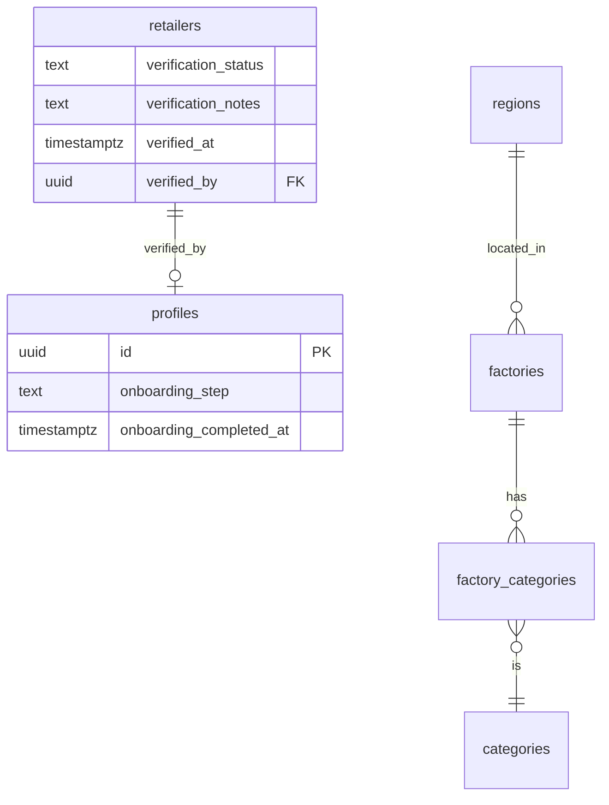

# Data Architecture: MOBIO — Sprint 5

> Discover Lojista — verification de retailers, onboarding state, índices GIN para busca, RPC search_factories

## Diagrama de Entidades — Alterações (Mermaid)



## Migrations — Sprint 5

4 arquivos em `supabase/migrations/` (timestamps 20260508120000–20260508120003):

| #   | Arquivo                                     | Conteúdo                                                              |
| --- | ------------------------------------------- | --------------------------------------------------------------------- |
| 1   | `20260508120000_retailer_verification.sql`  | ALTER retailers + verification columns + admin RLS policies + índices |
| 2   | `20260508120001_profile_onboarding.sql`     | ALTER profiles + onboarding_step + partial index                      |
| 3   | `20260508120002_factories_search_index.sql` | Índices GIN pg_trgm em factories.name e factories.slug                |
| 4   | `20260508120003_search_factories_rpc.sql`   | Function search_factories() SECURITY INVOKER                          |

## Alterações em Tabelas Existentes

### retailers (M1 — verification)

Novas colunas para workflow de verificação de lojistas pelo admin:

```sql
ALTER TABLE retailers
  ADD COLUMN verification_status TEXT NOT NULL DEFAULT 'unverified'
    CHECK (verification_status IN ('unverified', 'pending', 'verified', 'rejected')),
  ADD COLUMN verification_notes TEXT,
  ADD COLUMN verified_at TIMESTAMPTZ,
  ADD COLUMN verified_by UUID REFERENCES profiles(id);
```

- `verification_status`: estado do processo de verificação (TEXT + CHECK, não enum nativo)
- `verification_notes`: notas do admin sobre aprovação/rejeição
- `verified_at`: timestamp da ação de verificação
- `verified_by`: FK para profiles do admin que verificou

### profiles (M2 — onboarding)

Novas colunas para rastrear progresso do onboarding pós-aceite:

```sql
ALTER TABLE profiles
  ADD COLUMN onboarding_completed_at TIMESTAMPTZ,
  ADD COLUMN onboarding_step TEXT NOT NULL DEFAULT 'pending'
    CHECK (onboarding_step IN ('pending', 'profile', 'preferences', 'completed'));
```

- `onboarding_step`: etapa atual do fluxo de onboarding
- `onboarding_completed_at`: timestamp de conclusão (NULL enquanto não completo)

## RLS Policies — Sprint 5

| Tabela    | Policy                 | Operação | Quem                              |
| --------- | ---------------------- | -------- | --------------------------------- |
| retailers | retailers_select_admin | SELECT   | Admin (todos, inclusive inativos) |
| retailers | retailers_update_admin | UPDATE   | Admin (verificação)               |

Policies existentes em retailers (`retailers_select_active`, `retailers_insert_own`, `retailers_update_owner`) permanecem inalteradas.

## Índices — Sprint 5

```sql
-- M1: filtro de verification no painel admin
CREATE INDEX idx_retailers_verification_status ON retailers (verification_status);
CREATE INDEX idx_retailers_verified_by ON retailers (verified_by);

-- M2: partial index — apenas perfis com onboarding incompleto
CREATE INDEX idx_profiles_onboarding_step ON profiles (onboarding_step)
  WHERE onboarding_step != 'completed';

-- M3: busca textual no discover (pg_trgm já habilitado na migration 0001)
CREATE INDEX idx_factories_name_trgm ON factories USING GIN (name gin_trgm_ops);
CREATE INDEX idx_factories_slug_trgm ON factories USING GIN (slug gin_trgm_ops);
-- Nota: idx_products_name_trgm já existe (migration 0011) — não recriado
```

## Functions — Sprint 5

### search_factories (SECURITY INVOKER)

```sql
CREATE OR REPLACE FUNCTION search_factories(
  query_text TEXT DEFAULT NULL,
  region_id_filter UUID DEFAULT NULL,
  category_id_filter UUID DEFAULT NULL,
  limit_count INT DEFAULT 20
)
RETURNS SETOF factories
LANGUAGE plpgsql
SECURITY INVOKER
SET search_path = public
```

- **SECURITY INVOKER**: respeita RLS — `factories_select_active` já filtra `is_active = true`
- Filtros opcionais: nome (ILIKE com pg_trgm), região, categoria (via JOIN factory_categories)
- Limite máximo: 100 resultados (LEAST clamp)
- DISTINCT evita duplicatas quando factory tem múltiplas categorias

## Decisões — Sprint 5

| Decisão                                                 | Alternativa descartada     | Motivo                                                                                   |
| ------------------------------------------------------- | -------------------------- | ---------------------------------------------------------------------------------------- |
| TEXT + CHECK para verification_status                   | PostgreSQL enum            | Difícil alterar enum em produção; 4 valores estáveis suficientes para CHECK              |
| Partial index em onboarding_step WHERE != 'completed'   | Full index                 | Maioria dos perfis estará em 'completed'; partial index menor e mais eficiente           |
| SECURITY INVOKER na RPC search_factories                | SECURITY DEFINER           | RLS já cobre o filtro (factories_select_active); INVOKER é mais seguro por padrão        |
| Pular materialized view para search facets              | MV factories_search_facets | Otimização prematura; JOINs diretos com pg_trgm + índices existentes são suficientes     |
| Admin policies em retailers (SELECT + UPDATE)           | RBAC via JWT claims        | Admin é role verificado via team_members com is_active; consistente com padrão existente |
| verified_by referencia profiles (não auth.users)        | FK para auth.users         | Padrão do projeto: profiles é a tabela pública 1:1 com auth.users                        |
| factories usa is_active (boolean) — RPC filtra por isso | Coluna status TEXT         | Schema existente usa is_active; manter consistência com migrations anteriores            |
