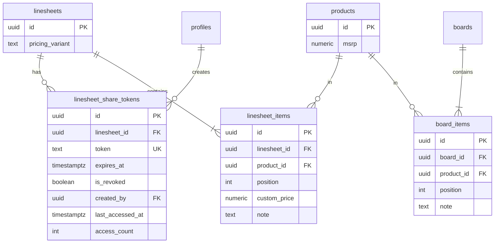

# Data Architecture — MOBIO Sprint 6 (Linesheets & Boards)

## Diagrama de Entidades (Mermaid)



## Tabelas Novas

### linesheet_share_tokens

Token de compartilhamento público para linesheets. Permite acesso sem login via RPC.

```sql
CREATE TABLE linesheet_share_tokens (
  id               UUID PRIMARY KEY DEFAULT gen_random_uuid(),
  linesheet_id     UUID NOT NULL REFERENCES linesheets(id) ON DELETE CASCADE,
  token            TEXT NOT NULL UNIQUE,
  expires_at       TIMESTAMPTZ,          -- NULL = sem expiração
  is_revoked       BOOLEAN NOT NULL DEFAULT false,
  created_by       UUID NOT NULL REFERENCES profiles(id) ON DELETE CASCADE,
  last_accessed_at TIMESTAMPTZ,
  access_count     INT NOT NULL DEFAULT 0,
  created_at       TIMESTAMPTZ DEFAULT now() NOT NULL,
  updated_at       TIMESTAMPTZ DEFAULT now() NOT NULL
);
```

**Token**: 256-bit hex gerado no Server Action (Node `crypto.randomBytes(32).toString('hex')`). UNIQUE index garante unicidade.

## Alterações em Tabelas Existentes

### linesheet_items — nota de anotação

```sql
ALTER TABLE linesheet_items ADD COLUMN note TEXT CHECK (length(note) <= 1000);
```

### board_items — nota de anotação

```sql
ALTER TABLE board_items ADD COLUMN note TEXT CHECK (length(note) <= 500);
```

### linesheets — variante de pricing

```sql
ALTER TABLE linesheets ADD COLUMN pricing_variant TEXT NOT NULL DEFAULT 'retailer'
  CHECK (pricing_variant IN ('retailer', 'msrp', 'custom'));
```

### products — preço sugerido ao público (MSRP)

```sql
ALTER TABLE products ADD COLUMN msrp NUMERIC(10, 2);
```

Mantém consistência com `wholesale_price` e `retail_price` (NUMERIC, não cents).

## Lógica de Pricing por Variante

| `pricing_variant` | Preço exibido                  | Fonte                                |
| ----------------- | ------------------------------ | ------------------------------------ |
| `retailer`        | `products.wholesale_price`     | Preço B2B da factory                 |
| `msrp`            | `products.msrp`                | Preço sugerido ao público            |
| `custom`          | `linesheet_items.custom_price` | Preço customizado pelo factory owner |

Se `linesheet_items.custom_price` estiver preenchido, ele sobrescreve o preço da variante selecionada (override por item).

## RLS Policies

### linesheet_share_tokens

| Operação | Quem                 | Critério                                        |
| -------- | -------------------- | ----------------------------------------------- |
| SELECT   | Factory members      | Via JOIN linesheets → team_members (factory_id) |
| INSERT   | Factory owner/member | `created_by = auth.uid()` + membership check    |
| UPDATE   | Factory owner/member | Membership check (revogar, atualizar expiração) |
| DELETE   | Factory owner        | Apenas atelier_owner                            |

**Acesso público via token**: Não usa policy de SELECT. Usa RPC `get_linesheet_by_token()` com `SECURITY DEFINER` que bypassa RLS.

### linesheet_items / board_items — colunas `note`

Herdam policies existentes (Sprint 3). UPDATE já autorizado para factory members (linesheet_items) e retailer members (board_items).

### linesheets — coluna `pricing_variant`

Herda policies existentes (Sprint 3). UPDATE autorizado para factory owner/member.

### products — coluna `msrp`

Herda policies existentes. UPDATE autorizado para factory owner/member.

## Triggers e Functions

| Trigger / Function                      | Tabela                   | Evento        | O que faz                                                                            |
| --------------------------------------- | ------------------------ | ------------- | ------------------------------------------------------------------------------------ |
| `trg_linesheet_share_tokens_updated_at` | `linesheet_share_tokens` | BEFORE UPDATE | `fn_update_timestamp()`                                                              |
| `fn_auto_position_board_item`           | —                        | —             | SECURITY DEFINER: se `position = 0`, calcula `MAX(position) + 1` no parent board     |
| `trg_board_items_auto_position`         | `board_items`            | BEFORE INSERT | Executa `fn_auto_position_board_item()`                                              |
| `fn_auto_position_linesheet_item`       | —                        | —             | SECURITY DEFINER: se `position = 0`, calcula `MAX(position) + 1` no parent linesheet |
| `trg_linesheet_items_auto_position`     | `linesheet_items`        | BEFORE INSERT | Executa `fn_auto_position_linesheet_item()`                                          |

### RPC: get_linesheet_by_token(p_token TEXT)

```sql
RETURNS JSONB LANGUAGE plpgsql SECURITY DEFINER SET search_path = public
```

**Motivo do SECURITY DEFINER**: Acesso público sem login. RLS está habilitado em todas as tabelas, mas este endpoint precisa retornar dados para visitantes anônimos que têm um token válido.

**Fluxo:**

1. Busca token em `linesheet_share_tokens` — valida `is_revoked = false` e expiração
2. Se inválido → retorna NULL (mensagem genérica no client)
3. Incrementa `access_count` e atualiza `last_accessed_at`
4. Busca linesheet + factory (nome, slug, logo)
5. Busca items com products + product_images
6. Retorna JSONB completo

**Campos retornados:**

```json
{
  "id": "uuid",
  "name": "Verão 2026",
  "pricing_variant": "retailer",
  "status": "active",
  "factory_name": "Atelier X",
  "factory_slug": "atelier-x",
  "factory_logo_url": "...",
  "items": [
    {
      "id": "uuid",
      "position": 1,
      "custom_price": null,
      "note": "Destaque da coleção",
      "product": {
        "id": "uuid",
        "name": "Vestido Midi",
        "slug": "vestido-midi",
        "description": "...",
        "reference": "VM-001",
        "wholesale_price": 250.00,
        "retail_price": 499.00,
        "msrp": 599.00,
        "min_order_qty": 3,
        "images": [...]
      }
    }
  ]
}
```

## Índices

```sql
-- linesheet_share_tokens: lookup por token (UNIQUE já cria índice)
-- linesheet_share_tokens: filtro por linesheet
CREATE INDEX idx_linesheet_share_tokens_linesheet_id ON linesheet_share_tokens (linesheet_id);
-- linesheet_share_tokens: filtro por revogação
CREATE INDEX idx_linesheet_share_tokens_is_revoked ON linesheet_share_tokens (is_revoked);
-- linesheet_share_tokens: filtro por criador (RLS)
CREATE INDEX idx_linesheet_share_tokens_created_by ON linesheet_share_tokens (created_by);

-- Índices compostos para ordenação por position dentro do parent
CREATE INDEX idx_board_items_board_position ON board_items (board_id, position);
CREATE INDEX idx_linesheet_items_linesheet_position ON linesheet_items (linesheet_id, position);
```

## Decisões

| Decisão                                       | Alternativa descartada                            | Motivo                                                                                                                     |
| --------------------------------------------- | ------------------------------------------------- | -------------------------------------------------------------------------------------------------------------------------- |
| NUMERIC(10,2) para `msrp`                     | INTEGER em cents                                  | Consistência com `wholesale_price`, `retail_price` e `custom_price` já existentes                                          |
| RPC SECURITY DEFINER para acesso público      | Policy SELECT pública em `linesheet_share_tokens` | Acesso sem login requer bypass de RLS; RPC valida token em query atômica (busca + incremento + retorno) sem expor a tabela |
| `position` default 0 + trigger auto-increment | Sem trigger (client calcula)                      | Evita race condition quando dois usuários adicionam item simultâneamente                                                   |
| TEXT + CHECK para `pricing_variant`           | Lookup table                                      | Enum estável com 3 valores fixos, sem label visível na UI                                                                  |
| `note` como coluna (não tabela separada)      | Tabela `item_annotations`                         | Relação 1:1, sem histórico necessário; coluna é mais simples e performática                                                |

## Migrations

| Arquivo                                         | O que faz                                                   |
| ----------------------------------------------- | ----------------------------------------------------------- |
| `20260508130000_linesheet_share_tokens.sql`     | Tabela + RLS + trigger + índices                            |
| `20260508130001_item_annotations.sql`           | ADD COLUMN note em linesheet_items e board_items            |
| `20260508130002_linesheet_variants.sql`         | ADD COLUMN pricing_variant em linesheets + msrp em products |
| `20260508130003_item_positions.sql`             | Índices compostos + triggers auto-position                  |
| `20260508130004_get_linesheet_by_token_rpc.sql` | RPC get_linesheet_by_token                                  |
