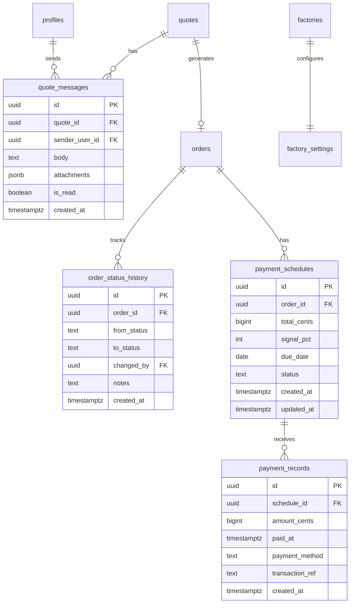

# Data Architecture: MOBIO — Sprint 7 (Quotes + Pedidos Cross-Pontas)

## Diagrama de Entidades (Mermaid)



## Tabelas

### quote_messages

Chat dentro da negociação de um quote. Factory e retailer trocam mensagens com anexos opcionais.

```sql
CREATE TABLE quote_messages (
  id              UUID PRIMARY KEY DEFAULT gen_random_uuid(),
  quote_id        UUID NOT NULL REFERENCES quotes(id) ON DELETE CASCADE,
  sender_user_id  UUID NOT NULL REFERENCES profiles(id) ON DELETE CASCADE,
  body            TEXT NOT NULL CHECK (char_length(body) <= 5000),
  attachments     JSONB NOT NULL DEFAULT '[]',
  is_read         BOOLEAN NOT NULL DEFAULT false,
  created_at      TIMESTAMPTZ DEFAULT now() NOT NULL
);
ALTER TABLE quote_messages ENABLE ROW LEVEL SECURITY;
```

### order_status_history

Timeline automática de transições de status dos pedidos. Inserção exclusiva via trigger SECURITY DEFINER.

```sql
CREATE TABLE order_status_history (
  id          UUID PRIMARY KEY DEFAULT gen_random_uuid(),
  order_id    UUID NOT NULL REFERENCES orders(id) ON DELETE CASCADE,
  from_status TEXT NOT NULL,
  to_status   TEXT NOT NULL,
  changed_by  UUID NOT NULL REFERENCES auth.users(id) ON DELETE CASCADE,
  notes       TEXT,
  created_at  TIMESTAMPTZ DEFAULT now() NOT NULL
);
ALTER TABLE order_status_history ENABLE ROW LEVEL SECURITY;
```

### payment_schedules

Plano de pagamento por pedido. Suporta sinal (default 30%) + parcela restante.

```sql
CREATE TABLE payment_schedules (
  id          UUID PRIMARY KEY DEFAULT gen_random_uuid(),
  order_id    UUID NOT NULL REFERENCES orders(id) ON DELETE CASCADE,
  total_cents BIGINT NOT NULL CHECK (total_cents > 0),
  signal_pct  INT NOT NULL DEFAULT 30 CHECK (signal_pct >= 0 AND signal_pct <= 100),
  due_date    DATE,
  status      TEXT NOT NULL DEFAULT 'pending'
                CHECK (status IN ('pending', 'paid', 'late', 'cancelled')),
  created_at  TIMESTAMPTZ DEFAULT now() NOT NULL,
  updated_at  TIMESTAMPTZ DEFAULT now() NOT NULL
);
ALTER TABLE payment_schedules ENABLE ROW LEVEL SECURITY;
```

### payment_records

Registros individuais de pagamento contra um schedule. Snapshot do valor + método + referência.

```sql
CREATE TABLE payment_records (
  id              UUID PRIMARY KEY DEFAULT gen_random_uuid(),
  schedule_id     UUID NOT NULL REFERENCES payment_schedules(id) ON DELETE CASCADE,
  amount_cents    BIGINT NOT NULL CHECK (amount_cents > 0),
  paid_at         TIMESTAMPTZ NOT NULL DEFAULT now(),
  payment_method  TEXT NOT NULL CHECK (payment_method IN ('pix', 'boleto', 'transfer', 'credit_card', 'other')),
  transaction_ref TEXT,
  created_at      TIMESTAMPTZ DEFAULT now() NOT NULL
);
ALTER TABLE payment_records ENABLE ROW LEVEL SECURITY;
```

### factory_settings (ALTER)

Adicionada coluna para política de cancelamento.

```sql
ALTER TABLE factory_settings
  ADD COLUMN cancellation_policy_hours INTEGER NOT NULL DEFAULT 24
    CHECK (cancellation_policy_hours >= 0);
```

## RLS Policies

| Tabela               | SELECT                                         | INSERT                                                                     | UPDATE                        | DELETE |
| -------------------- | ---------------------------------------------- | -------------------------------------------------------------------------- | ----------------------------- | ------ |
| quote_messages       | factory_members + retailer_members (non-draft) | factory_members (owner/member) + retailer_members (owner/buyer, non-draft) | recipient only (mark as read) | —      |
| order_status_history | factory_members + retailer_members             | — (trigger only)                                                           | —                             | —      |
| payment_schedules    | factory_members + retailer_members             | factory (owner/member)                                                     | factory (owner/member)        | —      |
| payment_records      | factory_members + retailer_members             | factory (owner/member)                                                     | —                             | —      |

## Triggers e Functions

| Trigger / Function                 | Tabela            | Evento        | O que faz                                                                                 |
| ---------------------------------- | ----------------- | ------------- | ----------------------------------------------------------------------------------------- |
| `fn_quote_message_touch_quote`     | quote_messages    | AFTER INSERT  | Atualiza `quotes.updated_at` ao receber nova mensagem                                     |
| `fn_log_order_status_change`       | orders            | BEFORE UPDATE | Insere row em `order_status_history` quando `status` muda                                 |
| `fn_can_cancel_order(UUID)`        | —                 | RPC           | Valida se pedido pode ser cancelado (status=pending + dentro da janela)                   |
| `accept_quote(UUID)`               | —                 | RPC           | Aceita quote atomicamente: valida status=sent + retailer membership, cria order com items |
| `trg_payment_schedules_updated_at` | payment_schedules | BEFORE UPDATE | Atualiza `updated_at` via `fn_update_timestamp()`                                         |

### fn_log_order_status_change (SECURITY DEFINER)

```sql
CREATE OR REPLACE FUNCTION fn_log_order_status_change()
RETURNS TRIGGER LANGUAGE plpgsql SECURITY DEFINER SET search_path = public AS $$
BEGIN
  -- SECURITY DEFINER: precisa bypass de RLS para inserir em order_status_history
  IF OLD.status IS DISTINCT FROM NEW.status THEN
    INSERT INTO order_status_history (order_id, from_status, to_status, changed_by)
    VALUES (NEW.id, OLD.status, NEW.status, (SELECT auth.uid()));
  END IF;
  RETURN NEW;
END;
$$;
```

### fn_can_cancel_order (SECURITY DEFINER)

```sql
CREATE OR REPLACE FUNCTION fn_can_cancel_order(p_order_id UUID)
RETURNS BOOLEAN LANGUAGE plpgsql SECURITY DEFINER SET search_path = public AS $$
DECLARE
  v_status TEXT; v_created_at TIMESTAMPTZ; v_factory_id UUID; v_policy_hours INTEGER;
BEGIN
  -- SECURITY DEFINER: precisa ler orders + factory_settings sem restrição de RLS
  SELECT status, created_at, factory_id INTO v_status, v_created_at, v_factory_id
  FROM orders WHERE id = p_order_id;
  IF v_status IS NULL OR v_status != 'pending' THEN RETURN false; END IF;
  SELECT COALESCE(cancellation_policy_hours, 24) INTO v_policy_hours
  FROM factory_settings WHERE factory_id = v_factory_id;
  IF v_policy_hours IS NULL THEN v_policy_hours := 24; END IF;
  RETURN (v_created_at + (v_policy_hours || ' hours')::INTERVAL) > now();
END;
$$;
```

### accept_quote (SECURITY DEFINER)

```sql
CREATE OR REPLACE FUNCTION accept_quote(p_quote_id UUID)
RETURNS UUID LANGUAGE plpgsql SECURITY DEFINER SET search_path = public AS $$
DECLARE
  v_quote RECORD; v_caller_id UUID; v_is_retailer BOOLEAN; v_order_id UUID;
BEGIN
  -- SECURITY DEFINER: operação atômica quote→order com bypass controlado
  v_caller_id := (SELECT auth.uid());
  IF v_caller_id IS NULL THEN RAISE EXCEPTION 'Not authenticated'; END IF;
  SELECT id, factory_id, retailer_id, status, total_cents, currency, notes
  INTO v_quote FROM quotes WHERE id = p_quote_id FOR UPDATE;
  IF v_quote IS NULL THEN RAISE EXCEPTION 'Quote not found'; END IF;
  IF v_quote.status != 'sent' THEN RAISE EXCEPTION 'Quote must be in "sent" status'; END IF;
  SELECT EXISTS (
    SELECT 1 FROM team_members WHERE user_id = v_caller_id
      AND retailer_id = v_quote.retailer_id
      AND role IN ('lojista_owner','lojista_buyer') AND is_active = true
  ) INTO v_is_retailer;
  IF NOT v_is_retailer THEN RAISE EXCEPTION 'Only retailer members can accept'; END IF;
  UPDATE quotes SET status = 'accepted', updated_at = now() WHERE id = p_quote_id;
  INSERT INTO orders (quote_id, factory_id, retailer_id, status, total_cents, currency, notes, created_by)
  VALUES (v_quote.id, v_quote.factory_id, v_quote.retailer_id, 'pending', v_quote.total_cents, v_quote.currency, v_quote.notes, v_caller_id)
  RETURNING id INTO v_order_id;
  -- order_items copiados por trg_orders_after_insert_copy_quote
  -- order_number gerado por trg_orders_before_insert_order_number
  RETURN v_order_id;
END;
$$;
```

## Índices

```sql
-- quote_messages: listagem por quote ordenada cronologicamente
CREATE INDEX idx_quote_messages_quote_created ON quote_messages (quote_id, created_at DESC);
CREATE INDEX idx_quote_messages_sender ON quote_messages (sender_user_id);

-- order_status_history: timeline do pedido
CREATE INDEX idx_order_status_history_order_created ON order_status_history (order_id, created_at DESC);
CREATE INDEX idx_order_status_history_changed_by ON order_status_history (changed_by);

-- payment_schedules: busca por pedido e filtro por status
CREATE INDEX idx_payment_schedules_order_id ON payment_schedules (order_id);
CREATE INDEX idx_payment_schedules_status ON payment_schedules (status);

-- payment_records: busca por schedule e ordenação por data
CREATE INDEX idx_payment_records_schedule_id ON payment_records (schedule_id);
CREATE INDEX idx_payment_records_paid_at ON payment_records (paid_at);
```

## Realtime

Tabelas adicionadas à publicação `supabase_realtime` com `REPLICA IDENTITY FULL`:

- `orders` — atualizações de status em tempo real
- `order_status_history` — timeline live
- `quote_messages` — chat live
- `payment_records` — confirmação de pagamento live

## Decisões

| Decisão                                                         | Alternativa descartada                                | Motivo                                                                                                   |
| --------------------------------------------------------------- | ----------------------------------------------------- | -------------------------------------------------------------------------------------------------------- |
| TEXT + CHECK para payment_method                                | Lookup table                                          | Conjunto estável (5 métodos), sem label na UI configurável pelo admin                                    |
| BEFORE UPDATE trigger para status history                       | Application-level logging                             | Garantia de captura: impossível perder transição, mesmo em RPCs SECURITY DEFINER                         |
| `accept_quote` como RPC atômica                                 | Duas chamadas separadas (update quote + insert order) | Atomicidade: quote e order mudam juntos ou nenhum muda. Evita estado inconsistente                       |
| `fn_can_cancel_order` como RPC                                  | CHECK constraint na tabela                            | Depende de join com factory_settings (hora configurável por fábrica). Constraint não suporta cross-table |
| REPLICA IDENTITY FULL                                           | DEFAULT                                               | Necessário para capturar OLD values em UPDATEs no Realtime (ex: from_status)                             |
| Correção idempotente na migration linesheets_retailer_ownership | Criar nova migration de fix                           | Migration ainda não tinha sido aplicada no remoto; DROP IF EXISTS é seguro e mantém sequência limpa      |

## Migrations

| Arquivo                                   | Descrição                                                        |
| ----------------------------------------- | ---------------------------------------------------------------- |
| `20260508150000_quote_messages.sql`       | Tabela quote_messages + RLS + trigger touch quote + índices      |
| `20260508150001_order_status_history.sql` | Tabela order_status_history + RLS + trigger log status + índices |
| `20260508150002_payment_tracking.sql`     | Tabelas payment_schedules + payment_records + RLS + índices      |
| `20260508150003_cancel_policy.sql`        | ALTER factory_settings + fn_can_cancel_order                     |
| `20260508150004_realtime_publication.sql` | REPLICA IDENTITY FULL + ALTER PUBLICATION                        |
| `20260508150005_accept_quote_rpc.sql`     | RPC accept_quote (state machine atômica)                         |
