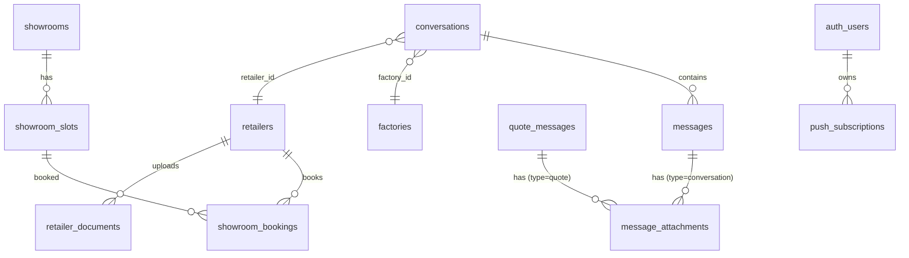

# Data Architecture: MOBIO — Sprint 8

Showrooms (slots + bookings), Mensageria (attachments + busca + contexto), Documentos do Lojista, Web Push.

## Diagrama de Entidades (Mermaid)



## Tabelas

### showroom_slots

Slots de horario criados pela fabrica para agendamento em showrooms.

```sql
CREATE TABLE showroom_slots (
  id               UUID PRIMARY KEY DEFAULT gen_random_uuid(),
  showroom_id      UUID NOT NULL REFERENCES showrooms(id) ON DELETE CASCADE,
  starts_at        TIMESTAMPTZ NOT NULL,
  ends_at          TIMESTAMPTZ NOT NULL,
  max_attendees    INT NOT NULL DEFAULT 1,
  is_available     BOOLEAN NOT NULL DEFAULT true,
  location_details TEXT,
  created_at       TIMESTAMPTZ DEFAULT now() NOT NULL,
  updated_at       TIMESTAMPTZ DEFAULT now() NOT NULL,
  CONSTRAINT chk_slot_time_range CHECK (ends_at > starts_at)
);
```

Migration: `20260508170000_showroom_slots.sql`

### showroom_bookings

Reservas feitas por lojistas em slots de showrooms.

```sql
CREATE TABLE showroom_bookings (
  id           UUID PRIMARY KEY DEFAULT gen_random_uuid(),
  slot_id      UUID NOT NULL REFERENCES showroom_slots(id) ON DELETE CASCADE,
  retailer_id  UUID NOT NULL REFERENCES retailers(id) ON DELETE CASCADE,
  status       TEXT NOT NULL DEFAULT 'pending'
                 CHECK (status IN ('pending', 'confirmed', 'cancelled')),
  notes        TEXT,
  confirmed_at TIMESTAMPTZ,
  created_at   TIMESTAMPTZ DEFAULT now() NOT NULL,
  updated_at   TIMESTAMPTZ DEFAULT now() NOT NULL,
  CONSTRAINT uq_booking_slot_retailer UNIQUE (slot_id, retailer_id)
);
```

Trigger `fn_booking_update_slot_availability`: ao INSERT ou UPDATE de status em bookings, recalcula `is_available` no slot baseado na contagem de bookings ativos vs `max_attendees`.

Migration: `20260508170001_showroom_bookings.sql`

### message_attachments

Attachments polimorfico para mensagens de conversations e quote_messages.

```sql
CREATE TABLE message_attachments (
  id              UUID PRIMARY KEY DEFAULT gen_random_uuid(),
  message_id      UUID NOT NULL,
  message_type    TEXT NOT NULL CHECK (message_type IN ('conversation', 'quote')),
  storage_path    TEXT NOT NULL,
  file_name       TEXT NOT NULL,
  file_type       TEXT NOT NULL,
  file_size_bytes INT NOT NULL CHECK (file_size_bytes > 0),
  uploaded_by     UUID NOT NULL REFERENCES auth.users(id) ON DELETE CASCADE,
  uploaded_at     TIMESTAMPTZ DEFAULT now() NOT NULL
);
```

Discriminador `message_type` determina se `message_id` referencia `messages` (conversation) ou `quote_messages` (quote). FK nao aplicada no banco por ser polimorfica — integridade garantida na camada de aplicacao.

Migration: `20260508170002_message_attachments.sql`

### retailer_documents

Documentos do lojista (CNPJ, contrato social, etc.) para verificacao.

```sql
CREATE TABLE retailer_documents (
  id           UUID PRIMARY KEY DEFAULT gen_random_uuid(),
  retailer_id  UUID NOT NULL REFERENCES retailers(id) ON DELETE CASCADE,
  doc_type     TEXT NOT NULL
                 CHECK (doc_type IN ('cnpj_card', 'contrato_social', 'inscricao_estadual', 'outros')),
  file_name    TEXT NOT NULL,
  storage_path TEXT NOT NULL,
  uploaded_by  UUID NOT NULL REFERENCES auth.users(id) ON DELETE CASCADE,
  uploaded_at  TIMESTAMPTZ DEFAULT now() NOT NULL,
  verified_at  TIMESTAMPTZ,
  verified_by  UUID REFERENCES auth.users(id) ON DELETE SET NULL
);
```

Migration: `20260508170003_retailer_documents.sql`

### push_subscriptions

Subscricoes Web Push (VAPID) por usuario.

```sql
CREATE TABLE push_subscriptions (
  id           UUID PRIMARY KEY DEFAULT gen_random_uuid(),
  user_id      UUID NOT NULL REFERENCES auth.users(id) ON DELETE CASCADE,
  endpoint     TEXT NOT NULL,
  p256dh       TEXT NOT NULL,
  auth         TEXT NOT NULL,
  user_agent   TEXT,
  is_active    BOOLEAN NOT NULL DEFAULT true,
  last_used_at TIMESTAMPTZ,
  created_at   TIMESTAMPTZ DEFAULT now() NOT NULL,
  CONSTRAINT uq_push_subscription_endpoint UNIQUE (user_id, endpoint)
);
```

Migration: `20260508170004_push_subscriptions.sql`

### conversations (ALTER — context threading)

Colunas adicionadas para threading por contexto:

```sql
ALTER TABLE conversations
  ADD COLUMN context_type TEXT CHECK (context_type IN ('general', 'quote', 'order', 'showroom_booking')),
  ADD COLUMN context_id UUID;

-- Soft constraint: context_id obrigatorio quando context_type definido (exceto general)
ALTER TABLE conversations ADD CONSTRAINT chk_conversation_context CHECK (...);
```

A constraint UNIQUE original `(factory_id, retailer_id)` foi substituida por indices parciais:

- `uq_conversation_pair_general` — uma conversa general por par
- `uq_conversation_context` — uma conversa por (par + context_type + context_id)

Migration: `20260508170005_conversation_context.sql`

## RLS Policies

| Tabela              | SELECT                                                                                                 | INSERT                | UPDATE                   | DELETE               |
| ------------------- | ------------------------------------------------------------------------------------------------------ | --------------------- | ------------------------ | -------------------- |
| showroom_slots      | factory_members + authorized retailers (available slots, published/active showrooms)                   | factory owner/member  | factory owner/member     | factory owner/member |
| showroom_bookings   | retailer_members (own) + factory_members (own showroom)                                                | retailer owner/buyer  | retailer + factory owner | —                    |
| message_attachments | conversation/quote membership (4 policies: conv_factory, conv_retailer, quote_factory, quote_retailer) | uploader (auth.uid()) | —                        | —                    |
| retailer_documents  | retailer_members + authorized factory owners                                                           | retailer owner        | retailer owner           | retailer owner       |
| push_subscriptions  | own (user_id = auth.uid())                                                                             | own                   | own                      | own                  |

## Triggers e Functions

| Trigger / Function                        | Tabela            | Evento                        | O que faz                                                                           |
| ----------------------------------------- | ----------------- | ----------------------------- | ----------------------------------------------------------------------------------- |
| `trg_showroom_slots_updated_at`           | showroom_slots    | BEFORE UPDATE                 | fn_update_timestamp()                                                               |
| `trg_showroom_bookings_updated_at`        | showroom_bookings | BEFORE UPDATE                 | fn_update_timestamp()                                                               |
| `fn_booking_update_slot_availability`     | showroom_bookings | AFTER INSERT/UPDATE OF status | Recalcula is_available no slot baseado em count de bookings ativos vs max_attendees |
| `search_messages(query, conversation_id)` | messages          | RPC                           | Full-text search com tsquery em portugues, SECURITY DEFINER, verifica membership    |

```sql
-- fn_booking_update_slot_availability (SECURITY DEFINER)
-- Motivo: precisa UPDATE em showroom_slots ignorando RLS do caller
CREATE OR REPLACE FUNCTION fn_booking_update_slot_availability()
RETURNS TRIGGER LANGUAGE plpgsql SECURITY DEFINER SET search_path = public AS $$
DECLARE
  v_count INT;
  v_max   INT;
BEGIN
  SELECT COUNT(*) INTO v_count FROM showroom_bookings
  WHERE slot_id = NEW.slot_id AND status IN ('pending', 'confirmed');
  SELECT max_attendees INTO v_max FROM showroom_slots WHERE id = NEW.slot_id;
  UPDATE showroom_slots SET is_available = (v_count < v_max) WHERE id = NEW.slot_id;
  RETURN NEW;
END;
$$;
```

```sql
-- search_messages RPC (SECURITY DEFINER)
-- Motivo: query usa tsvector que precisa acesso direto; verifica membership explicitamente
CREATE OR REPLACE FUNCTION search_messages(p_query TEXT, p_conversation_id UUID)
RETURNS SETOF messages LANGUAGE plpgsql SECURITY DEFINER SET search_path = public AS $$
-- Verifica se caller eh membro da conversation, depois busca com plainto_tsquery('portuguese', ...)
$$;
```

## Indices

```sql
-- showroom_slots
CREATE INDEX idx_showroom_slots_showroom_starts ON showroom_slots (showroom_id, starts_at);
CREATE INDEX idx_showroom_slots_is_available ON showroom_slots (is_available) WHERE is_available = true;

-- showroom_bookings
CREATE INDEX idx_showroom_bookings_slot_status ON showroom_bookings (slot_id, status);
CREATE INDEX idx_showroom_bookings_retailer_status ON showroom_bookings (retailer_id, status);

-- message_attachments
CREATE INDEX idx_message_attachments_message ON message_attachments (message_id, message_type);
CREATE INDEX idx_message_attachments_uploaded_by ON message_attachments (uploaded_by);

-- retailer_documents
CREATE INDEX idx_retailer_documents_retailer_type ON retailer_documents (retailer_id, doc_type);
CREATE INDEX idx_retailer_documents_uploaded_by ON retailer_documents (uploaded_by);

-- push_subscriptions
CREATE INDEX idx_push_subscriptions_user_active ON push_subscriptions (user_id) WHERE is_active = true;
CREATE INDEX idx_push_subscriptions_endpoint ON push_subscriptions (endpoint);

-- conversations (context threading)
CREATE INDEX idx_conversations_context ON conversations (factory_id, retailer_id, context_type, context_id);

-- messages (full-text search)
CREATE INDEX idx_messages_body_tsv ON messages USING GIN (body_tsv);
```

## Storage Buckets

| Bucket                | Publico | Path Pattern                                          | Acesso                                        |
| --------------------- | ------- | ----------------------------------------------------- | --------------------------------------------- |
| `message-attachments` | Nao     | `{conversation_id\|quote_id}/{message_id}/{filename}` | Membros da conversa/quote                     |
| `retailer-documents`  | Nao     | `{retailer_id}/{doc_type}/{filename}`                 | Retailer members + factory owners autorizados |

Migration: `20260508170006_storage_buckets_s8.sql`

## Realtime

Tabelas adicionadas ao `supabase_realtime`:

- `messages` (verificado se ja existia, adicionado se nao)
- `message_attachments` (novo)
- `showroom_bookings` (novo — notificacao de status de reserva)

Todas com `REPLICA IDENTITY FULL`.

Migration: `20260508170007_realtime_publication_s8.sql`

## Decisoes

| Decisao                                                            | Alternativa descartada                                     | Motivo                                                               |
| ------------------------------------------------------------------ | ---------------------------------------------------------- | -------------------------------------------------------------------- |
| Polymorphic `message_attachments` com discriminator `message_type` | 2 tabelas separadas (conv_attachments + quote_attachments) | Evita duplicacao de schema; queries unificadas por message_id + type |
| TEXT + CHECK para status/doc_type                                  | PostgreSQL native ENUM                                     | Dificil alterar enum em producao                                     |
| Partial unique indexes em conversations (context)                  | UNIQUE constraint simples                                  | Permite multiplas conversations por par com contextos diferentes     |
| `is_available` gerenciado por trigger                              | Calculo on-the-fly no SELECT                               | Performance — evita COUNT em cada query de listagem de slots         |
| Full-text search com tsvector STORED                               | Busca ILIKE                                                | Performance com indice GIN; suporte a ranking nativo                 |
