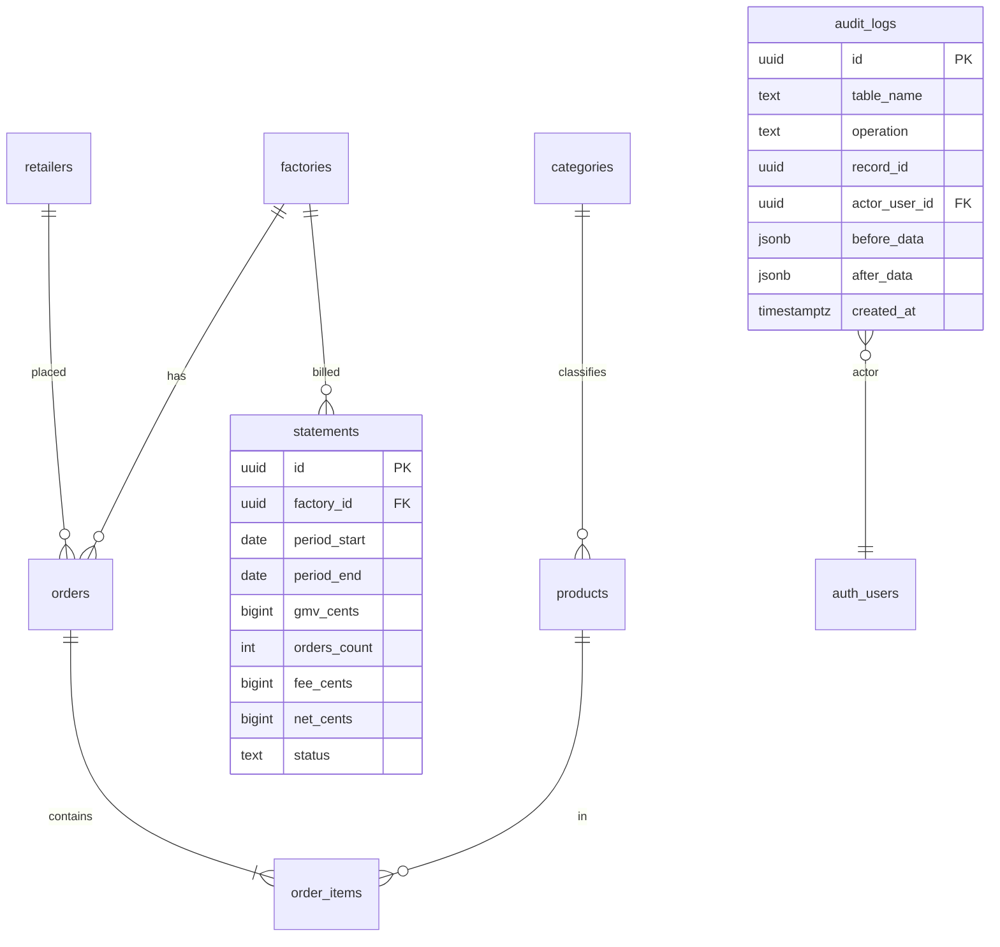

# Data Architecture: MOBIO — Sprint 9

## Escopo

Analytics (factory + retailer + admin), Statements mensais (fatura GMV), Audit Logs com triggers genéricos.

## Diagrama de Entidades (Mermaid)



## Tabelas

### statements

Fatura mensal por factory. Gerada manualmente pelo admin via RPC `fn_generate_monthly_statements`. Imutável após `issued`.

```sql
CREATE TABLE statements (
  id           UUID PRIMARY KEY DEFAULT gen_random_uuid(),
  factory_id   UUID NOT NULL REFERENCES factories(id) ON DELETE CASCADE,
  period_start DATE NOT NULL,
  period_end   DATE NOT NULL,
  gmv_cents    BIGINT NOT NULL DEFAULT 0,
  orders_count INT NOT NULL DEFAULT 0,
  fee_cents    BIGINT NOT NULL DEFAULT 0,  -- taxa da plataforma
  net_cents    BIGINT NOT NULL DEFAULT 0,  -- gmv - fee
  status       TEXT NOT NULL DEFAULT 'draft'
                 CHECK (status IN ('draft', 'issued', 'paid')),
  created_at   TIMESTAMPTZ DEFAULT now() NOT NULL,
  updated_at   TIMESTAMPTZ DEFAULT now() NOT NULL,
  CONSTRAINT uq_statement_factory_period UNIQUE (factory_id, period_start)
);
```

### audit_logs

Log imutável de alterações em tabelas críticas. Sem UPDATE/DELETE policies — clients apenas leem (admin).

```sql
CREATE TABLE audit_logs (
  id             UUID PRIMARY KEY DEFAULT gen_random_uuid(),
  table_name     TEXT NOT NULL,
  operation      TEXT NOT NULL CHECK (operation IN ('INSERT', 'UPDATE', 'DELETE')),
  record_id      UUID NOT NULL,
  actor_user_id  UUID REFERENCES auth.users(id) ON DELETE SET NULL,
  before_data    JSONB,
  after_data     JSONB,
  created_at     TIMESTAMPTZ DEFAULT now() NOT NULL
);
```

## RLS Policies

| Tabela     | SELECT                              | INSERT                           | UPDATE     | DELETE       |
| ---------- | ----------------------------------- | -------------------------------- | ---------- | ------------ |
| statements | factory members (own) + admin (all) | admin only                       | admin only | — (imutável) |
| audit_logs | admin only                          | — (via trigger SECURITY DEFINER) | —          | —            |

## RPCs (Functions)

### get_factory_analytics(p_factory_id, p_start, p_end)

SECURITY DEFINER + SET search_path = public. Verifica membership via team_members. Retorna:

- `gmv_cents`, `orders_count`, `avg_ticket_cents`, `active_retailers`
- `top_products` (JSON, top 10 por valor), `top_retailers` (JSON, top 10 por valor)
- Filtra orders com status IN ('confirmed', 'in_production', 'shipped', 'delivered')

### get_retailer_analytics(p_retailer_id, p_start, p_end)

SECURITY DEFINER + SET search_path = public. Verifica membership via team_members. Retorna:

- `total_spent_cents`, `orders_count`, `avg_ticket_cents`
- `top_factories` (JSON, top 10), `top_categories` (JSON, top 10 via products.category_id)

### get_admin_overview()

SECURITY DEFINER + SET search_path = public. Verifica role = 'admin'. Retorna:

- `total_factories`, `total_retailers`, `total_orders`, `total_gmv_cents`, `signups_last_30d`

### fn_generate_monthly_statements(p_period_start DATE)

SECURITY DEFINER + SET search_path = public. Admin only. Agrega orders com status 'delivered' no período (updated_at). Insere com ON CONFLICT DO NOTHING (idempotente). Retorna count de statements gerados. `fee_cents` default 0 — será configurável em sprint futura.

## Triggers e Functions

| Trigger / Function               | Tabela               | Evento                     | O que faz                                                          |
| -------------------------------- | -------------------- | -------------------------- | ------------------------------------------------------------------ |
| `fn_log_audit()`                 | (genérica)           | AFTER INSERT/UPDATE/DELETE | Insere em audit_logs com TG_TABLE_NAME, TG_OP, OLD/NEW, auth.uid() |
| `trg_factories_audit`            | factories            | AFTER I/U/D                | fn_log_audit                                                       |
| `trg_retailers_audit`            | retailers            | AFTER I/U/D                | fn_log_audit                                                       |
| `trg_team_members_audit`         | team_members         | AFTER I/U/D                | fn_log_audit                                                       |
| `trg_orders_audit`               | orders               | AFTER I/U/D                | fn_log_audit                                                       |
| `trg_factory_settings_audit`     | factory_settings     | AFTER I/U/D                | fn_log_audit                                                       |
| `trg_factory_invitations_audit`  | factory_invitations  | AFTER I/U/D                | fn_log_audit                                                       |
| `trg_authorized_retailers_audit` | authorized_retailers | AFTER I/U/D                | fn_log_audit                                                       |
| `trg_plans_audit`                | plans                | AFTER I/U/D                | fn_log_audit                                                       |
| `trg_subscriptions_audit`        | subscriptions        | AFTER I/U/D                | fn_log_audit                                                       |
| `trg_statements_updated_at`      | statements           | BEFORE UPDATE              | fn_update_timestamp                                                |

`fn_log_audit` usa SECURITY DEFINER para bypass de RLS na tabela audit_logs (que não tem INSERT policy para clients).

## Índices

```sql
-- Analytics: range queries por factory + data
CREATE INDEX idx_orders_factory_created ON orders (factory_id, created_at);
CREATE INDEX idx_orders_retailer_created ON orders (retailer_id, created_at);
CREATE INDEX idx_orders_status_created ON orders (status, created_at);

-- Statements
CREATE INDEX idx_statements_factory_id ON statements (factory_id);
CREATE INDEX idx_statements_period ON statements (period_start, period_end);
CREATE INDEX idx_statements_status ON statements (status);

-- Audit logs
CREATE INDEX idx_audit_logs_table_created ON audit_logs (table_name, created_at DESC);
CREATE INDEX idx_audit_logs_actor_created ON audit_logs (actor_user_id, created_at DESC);
CREATE INDEX idx_audit_logs_record_id ON audit_logs (record_id);
```

## Decisões

| Decisão                                               | Alternativa descartada             | Motivo                                                                                       |
| ----------------------------------------------------- | ---------------------------------- | -------------------------------------------------------------------------------------------- |
| RPCs SECURITY DEFINER em vez de views                 | Materialized views                 | RPCs permitem range filter dinâmico e auth check no mesmo call                               |
| fee_cents default 0 em statements                     | Configurável por factory           | Sprint futura adicionará fee rate em factory_settings; por ora admin pode editar manualmente |
| audit_logs via trigger genérico                       | Tabela de audit por domínio        | Uma tabela centralizada simplifica viewer admin e queries cross-table                        |
| ON CONFLICT DO NOTHING em generate_statements         | UPSERT com recalculating           | Idempotência sem sobrescrever statements já emitidos (issued/paid)                           |
| Audit em retailers inclui verification_status changes | Trigger separado para verification | Trigger genérico já captura OLD/NEW completo incluindo verification_status                   |

## Migrations

| Arquivo                                          | Conteúdo                                               |
| ------------------------------------------------ | ------------------------------------------------------ |
| `20260508190000_analytics_rpcs.sql`              | 3 RPCs (factory, retailer, admin) + índices compostos  |
| `20260508190001_statements.sql`                  | Tabela statements + RLS + trigger updated_at + índices |
| `20260508190002_generate_monthly_statements.sql` | RPC fn_generate_monthly_statements                     |
| `20260508190003_audit_logs.sql`                  | Tabela audit_logs + RLS (admin read-only) + índices    |
| `20260508190004_audit_log_triggers.sql`          | fn_log_audit + triggers em 9 tabelas críticas          |
